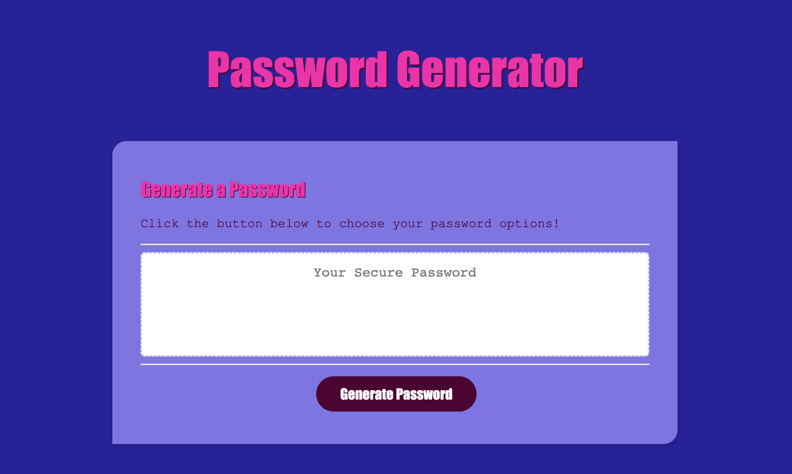
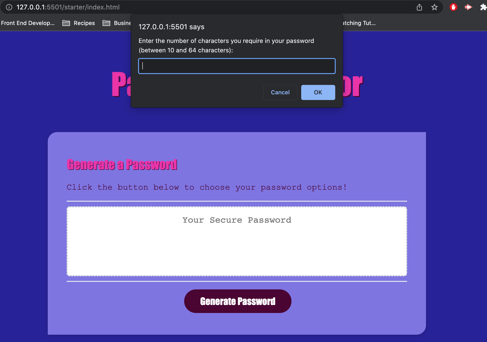
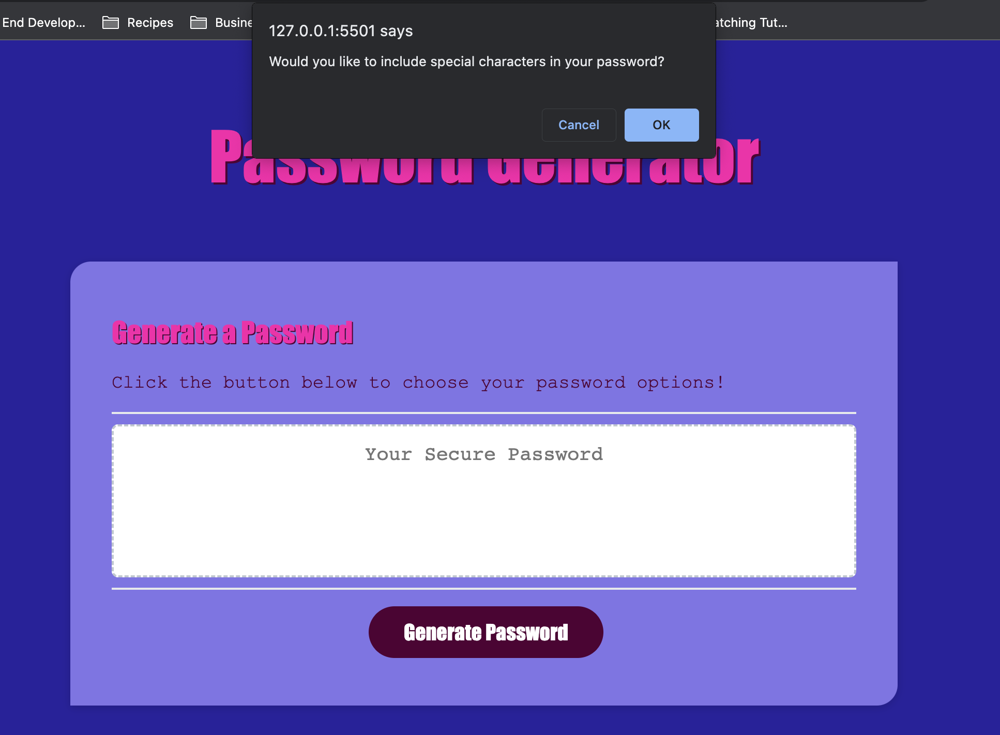
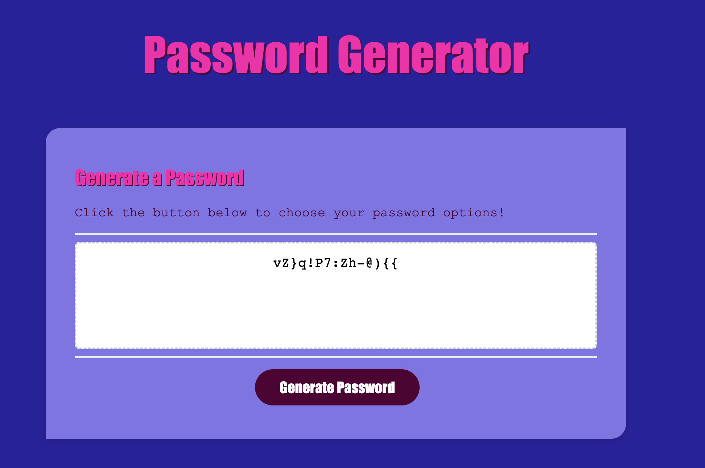

# 05-password-generator
## Description

The purpose of this project was to write Javascript code to generate a random password from the user's criteria:

- Password length (between 10 and 64 characters)
- whether or not to include special characters, numbers, uppercase or lowercase characters

The user must click the generate password button to then be prompted to select certain criteria. The user is warned if their criteria does not meet requirements (e.g. if character amount is too small/big, character amount is not a number, or for not choosing any character types to be used to generate their password).

The random password is then displayed in the text box.

My motivation for this project was to level up my understanding of Javascript and practice using more complicated code than what I am used to. I have been able to put into working practice .concat of strings, writing and calling functions, for loops, if/else statements and using Math.random.

I also tweaked the HTML and CSS starter code slightly to make my web application more unique and to keep up my knowledge in these areas.

Though this project was challenging and complicated at times, I feel I have consolidated some key aspects of fundamental Javascript code. 

## Installation

N/A

## Usage

To view the password generator, follow the link to the deployed page: https://sprouts-parent.github.io/05-password-generator/ 

From there, just open the console within the inspector and you will see the print out of results.

## Credits

Thank you so muck to Suresh Kumar who helped me to see the wood for the trees during this project!
I used the following references for this project:
- Javascript A Beginners Guide by John Pollock (5th edition, 2020)
- Begin to Code with Javascript by Rob Miles (2022)
- https://www.w3schools.com/jsref/jsref_concat_string.asp
- https://www.w3schools.com/js/js_functions.asp

## License

MIT License

---
